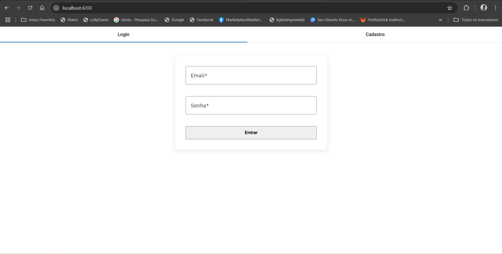
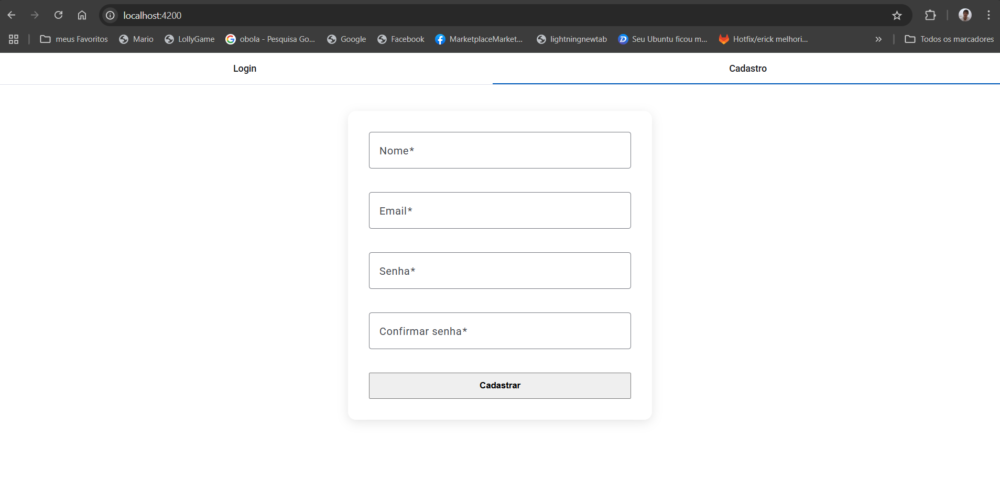
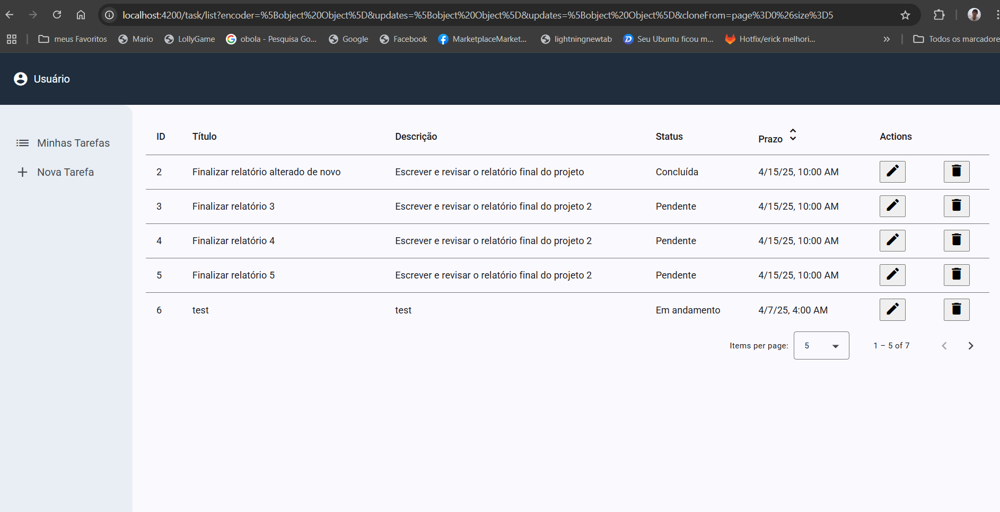
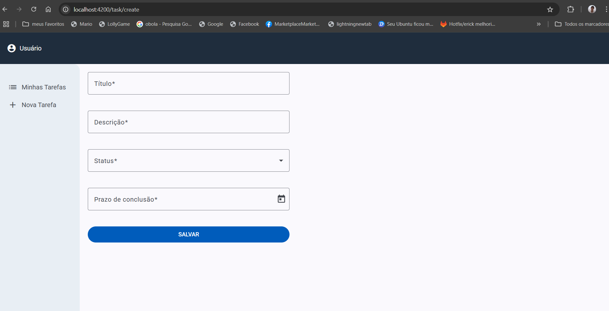
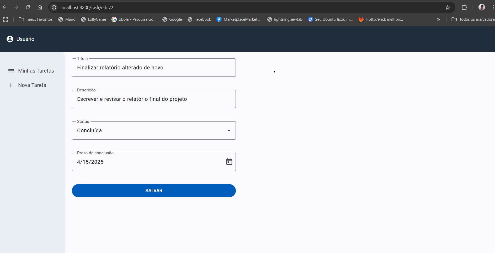

# 🗂️ Task Manager Frontend

Este é o frontend da aplicação **Task Manager**, desenvolvido com **Angular 19**, voltado para o gerenciamento de tarefas. A aplicação permite criar, visualizar e excluir tarefas de maneira simples e eficiente.

---

## 🚀 Tecnologias Utilizadas

- [Angular 19](https://angular.io/)
- TypeScript
- RxJS
- HTML5 e SCSS
- Angular Material (ou semelhante, caso seja adicionado)

---

## 📦 Pré-requisitos

Antes de começar, você precisa ter instalado na sua máquina:

- Node.js (recomendado: v18 ou superior)
- Angular CLI (`npm install -g @angular/cli`)

---

## ▶️ Como rodar o projeto

### 1. Clone o repositório

```bash
git clone https://github.com/erickcastelo/task-manager-frontend.git
cd task-manager-frontend
```

### 2. Instale as dependências

```bash
npm install
```

### 3. Rode o servidor de desenvolvimento

```bash
ng serve
```

Acesse o app via navegador:

```
http://localhost:4200/
```

---

## 🧩 Funcionalidades

- ✅ Listagem de tarefas
- ➕ Cadastro de nova tarefa
- 🗑️ Exclusão de tarefas
- 🎯 Login
- 🔁 Cadastro de usuarios

> ⚠️ \*Nota: A Parte de login não está finalizada, ou seja, não há integração com o backend

---

## 🔍 Estrutura de Pastas

```
src/
├── app/
│   ├── components/
│   │   ├── task-form/
│   │   └── task-list/
│   ├── services/
│   │   └── task.service.ts
│   ├── models/
│   │   └── task.model.ts
│   └── app.component.ts
├── assets/
├── environments/
│   ├── environment.ts
│   └── environment.prod.ts
```







## 👨‍💻 Autor

Desenvolvido por **Erick Castelo Branco**.  
[GitHub](https://github.com/erickcastelo)
